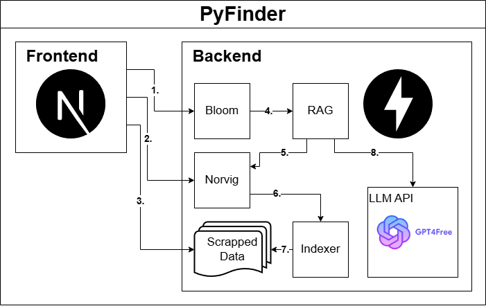

# 📘 PyFinder

**PyFinder** is a powerful application that enables fast, intelligent search through Python's built-in documentation using advanced retrieval methods.

> \[!IMPORTANT]
> 📄 We **highly recommend** reading [`README.md`](./README.md) to understand the structure of project and how to run it.

---

## 📑 Table of Contents

- [🔍 Modes](#-modes)
- [⚙️ Technology Stack](#️-technology-stack)
  - [🧪 Backend](#-backend)
    - [📘 Selected Python libraries](#-selected-python-libraries)
  - [🎨 Frontend](#-frontend)
  - [🧠 Models](#-models)
- [🧠 System Design](#-system-design)
  - [🧩 Workflows](#-workflows)
- [🧩 Components](#-components)
  - [🌸 Bloom Filter](#-bloom-filter)
  - [📝 Norvig Spell Corrector](#-norvig-spell-corrector)
  - [📚 Indexer (Inverted Index)](#-indexer-inverted-index)
  - [🧬 Indexer (LLM Embeddings + Ball Tree)](#-indexer-llm-embeddings--ball-tree)
  - [🤖 RAG (Retrieval-Augmented Generation)](#-rag-retrieval-augmented-generation)
- [🚧 Challenges & Solutions](#-challenges--solutions)
- [🌟 Feature Comparison](#-feature-comparison)

---

## 🔍 Modes

**PyFinder** has two primary modes of operation:

- **Search Mode**
  Quickly find relevant documentation using one of two indexing approaches:

  - **Inverted Index**
  - **LLM Embeddings + Ball Tree**

- **Chat Mode (RAG)**
  Ask natural language questions and get intelligent, sourced answers via Retrieval-Augmented Generation (RAG) powered by LLMs.

---

## ⚙️ Technology Stack

### 🧪 Backend

- **Python 3.12** — Primary language
- **FastAPI** — Web framework

#### 📘 Selected Python libraries

- **NLTK** — Text processing
- **scikit-learn** — ML algorithms (e.g., Ball Tree)
- **PyTorch** — Neural network library
- **Transformers** — LLM models
- **g4f** — Free LLM API access (e.g., `evil`, `command-r`, `qwen`)
- **pybloom-live** — Probabilistic filtering (bad words)

### 🎨 Frontend

- **Next.js** — React framework for UI

### 🧠 Models

- Hosted LLMs: `qwen-2-72b`, `qwen-2.5-coder-32b`,`gpt-4o`, `wizardlm-2-7b`, `wizardlm-2-8x22b`, `dolphin-2.6`, `dolphin-2.9`, `glm-4`, `evil`, `command-r`

- Local LLMs: [`arnir0/Tiny-LLM`](https://huggingface.co/arnir0/Tiny-LLM), [`sshleifer/tiny-gpt2`](https://huggingface.co/sshleifer/tiny-gpt2)
- Embedding Model: `sentence-transformers/all-MiniLM-L6-v2`

---

## 🧠 System Design

### 🧩 Workflows

1. **Frontend ➔ Bloom** — Filters bad content
2. **Frontend ➔ Norvig** — Spell corrector
3. **Frontend ➔ Scraped Data** — Displays scraped docs
4. **Bloom ➔ RAG** — Sends clean query to RAG
5. **RAG ➔ Norvig** — Filters bad content
6. **Norvig ➔ Indexer** — Fetches relevant docs
7. **Indexer ➔ Scraped Data** — Retrieves matched files
8. **RAG ➔ LLM API** — Generates and returns LLM answer

---

## 🧩 Components

### 🌸 Bloom Filter

#### 1. Bad Word List Aggregation

Sources merged from:

- [Google Profanity List](https://github.com/coffee-and-fun/google-profanity-words/tree/main)
- [LDNOOBW (English)](https://github.com/LDNOOBW/List-of-Dirty-Naughty-Obscene-and-Otherwise-Bad-Words/blob/master/en)
- [LDNOOBW (Russian)](https://github.com/LDNOOBW/List-of-Dirty-Naughty-Obscene-and-Otherwise-Bad-Words/blob/master/ru)

The merged document is [`data/bad_words/bad_words.txt`](./data/bad_words/bad_words.txt)

#### 2. Efficient Storage

- Uses `ScalableBloomFilter` (5000-word capacity, 0.1% false positive)
- Stores words and phrases (up to 5 words)

#### 3. Moderation Logic

- Scans individual and multi-word phrases
- Returns first match with offending term

#### Key Features

- Multi-language support
- Auto cache rebuild
- Configurable phrase length

---

### 📝 Norvig Spell Corrector

[The original post](https://norvig.com/spell-correct.html)

#### 1. Text Preprocessing

- Removes stopwords
- Tokenizes lowercase words
- Strips non-ASCII characters

#### 2. Language Model

- Builds frequency model from cleaned docs
- Calculates word probabilities
- Supports precomputed edit dictionaries

#### 3. Suggestions

- Edit types: deletion, transposition, replacement, insertion
- Filters to valid words, returns most likely candidate

#### 4. Query Processing

- Retains punctuation
- Skips stopwords if configured

#### Optimizations

- Precomputed dictionaries for speed
- Stopword filtering for accuracy
- Tunable max edit distance

---

### 📚 Indexer (Inverted Index)

#### 1. Indexing

- Maps words to documents
- Stores:
  - Word counts (TF)
  - Doc lengths (normalization)
  - Titles

#### 2. Search

- Uses Levenshtein distance
- Ranks using TF-IDF weighted by similarity:
  \[
  \text{Score} = \frac{1}{1 + \text{edit distance}}
  \]

#### 3. Fuzzy Matching

- Matches within edit distance
- Partial matches contribute based on similarity

---

### 🧬 Indexer (LLM Embeddings + Ball Tree)

#### 1. Embedding Generation

- Converts documents to dense vectors
- Uses `mean` pooling

#### 2. Indexing

- Processes in batches
- Stores embeddings in a Ball Tree

#### 3. Search

- Embeds query
- Finds top-k nearest documents
- Returns documents with corresponding distances (scores)

#### Strengths

- Handles semantic similarity
- Recognizes paraphrasing and related terms

---

### 🤖 RAG (Retrieval-Augmented Generation)

#### 1. Prompt Engineering

- Restricts answers to context (fetched Python documents)
- Requires citations
- Forbids unsourced info and code

#### 2. Modes

- **Streaming**: Live response with time/data metrics
- **Batch**: Instant complete answers with error handling

#### 3. Retrieval Process

1. Find top-k nearest documents using indexer
2. Build context using the found documents
3. Combine context with user query
4. Pass to LLM with source tracking

#### 4. LLM Handling

- Async/sync client support
- Streaming + rate limiting
- Error and timeout handling

#### Key Features

- Python-only responses
- JSON-formatted streaming output

---

## 🚧 Challenges & Solutions

| Problem                           | Solution/Status                                                                    |
| --------------------------------- | ---------------------------------------------------------------------------------- |
| Word2Vec indexer was not accurate | Switched to LLM embeddings                                                         |
| Local LLM too slow or heavy       | Switched to free hosted APIs ([g4f](https://github.com/xtekky/gpt4free/tree/main)) |
| Poor spelling correction          | Added Norvig-based spell corrector                                                 |

---

## 🌟 Feature Comparison

| Approach         | Technologies                          | Advantages                                                                       |
| ---------------- | ------------------------------------- | -------------------------------------------------------------------------------- |
| Inverted Index   | Inverted Index + Levenshtein distance | High speed, exact match, lightweight                                             |
| Embedding Search | LLM Embeddings + Ball Tree            | Resilient to synonyms and phrasing                                               |
| RAG              | API + Prompt Engineering              | Multi-source synthesis, deep answers, citation-based, filters irrelevant content |
