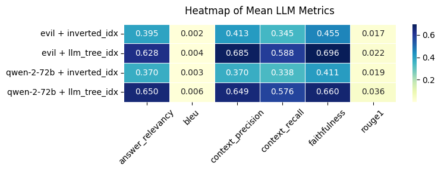
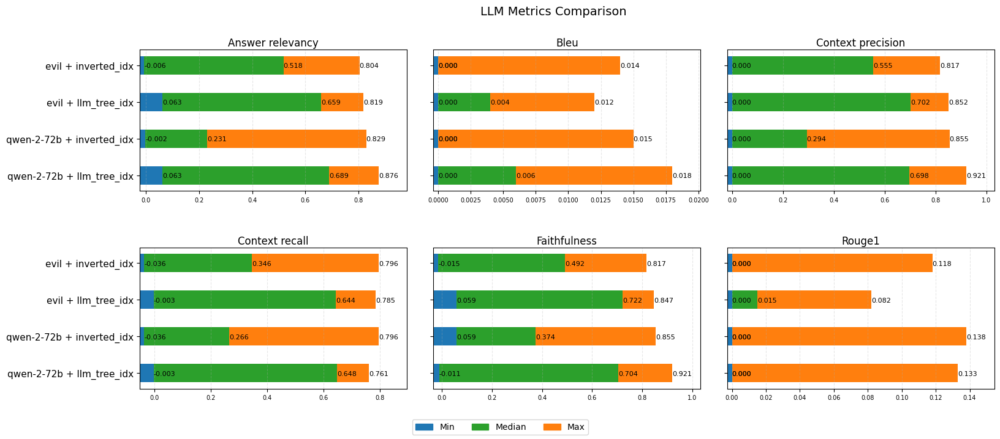
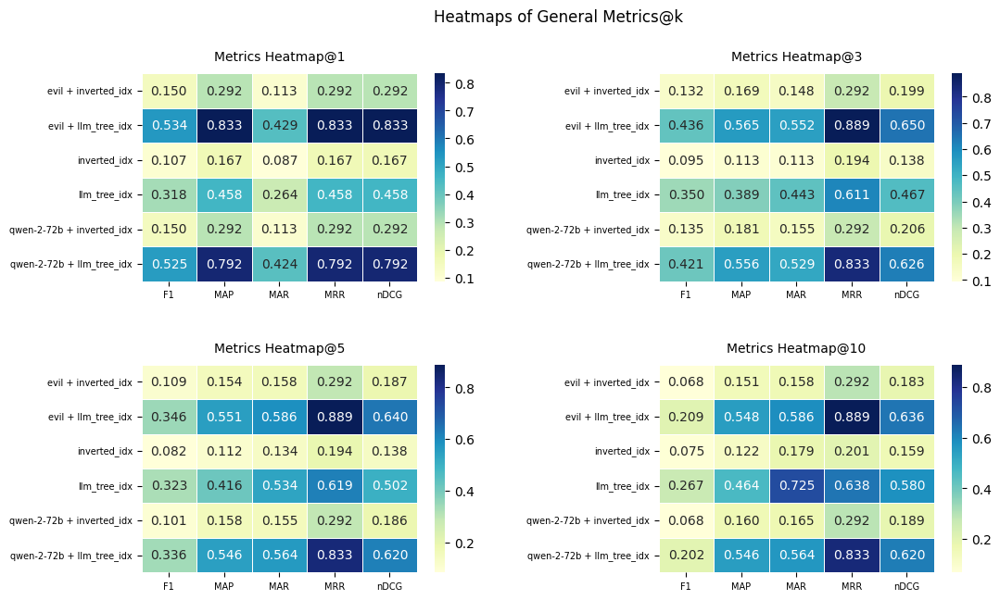
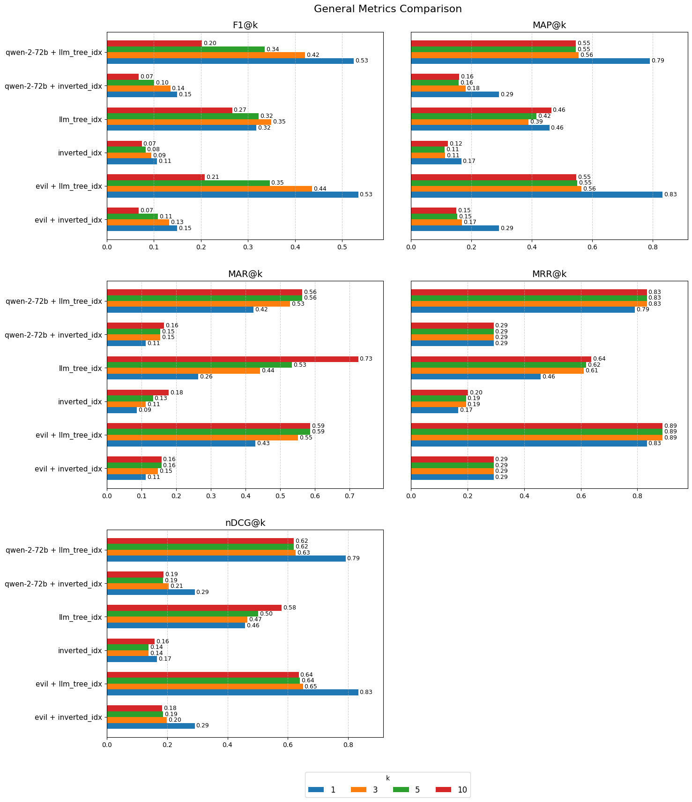

# 📘 PyFinder

**PyFinder** is a powerful application that enables fast, intelligent search through Python's built-in documentation using advanced retrieval methods.

> \[!IMPORTANT]
> 📄 We **highly recommend** reading [`README.md`](./README.md) to understand the structure of project and how to run it.

---

## 📑 Table of Contents

- [🔍 Modes](#-modes)
- [⚙️ Technology Stack](#️-technology-stack)
  - [🧪 Backend](#-backend)
    - [📘 Selected Python libraries](#-selected-python-libraries)
  - [🎨 Frontend](#-frontend)
  - [🧠 Models](#-models)
- [🧠 System Design](#-system-design)
  - [🧩 Workflows](#-workflows)
- [🧩 Components](#-components)
  - [🌸 Bloom Filter](#-bloom-filter)
  - [📝 Norvig Spell Corrector](#-norvig-spell-corrector)
  - [📚 Indexer (Inverted Index)](#-indexer-inverted-index)
  - [🧬 Indexer (LLM Embeddings + Ball Tree)](#-indexer-llm-embeddings--ball-tree)
  - [🤖 RAG (Retrieval-Augmented Generation)](#-rag-retrieval-augmented-generation)
- [🚧 Challenges & Solutions](#-challenges--solutions)
- [🌟 Feature Comparison](#-feature-comparison)
- [📈 Evaluation & Results](#-evaluation-and-results)
  - [🧮 Metrics](#-metrics)
    - [🤖 LLM-specific Metrics](#-llm-specific-metrics)
    - [📊 General Ranking Metrics](#-general-ranking-metrics)
  - [🔄 Evaluation Workflow](#-evaluation-workflow)
  - [🏆 Results](#-results)
    - [🤖 LLM-specific Results](#-llm-specific-results)
    - [📊 General Ranking Results](#-general-ranking-results)
- [💬 Discussion](#-discussion)

---

## 🔍 Modes

**PyFinder** has two primary modes of operation:

- **Search Mode**
  Quickly find relevant documentation using one of two indexing approaches:

  - **Inverted Index**
  - **LLM Embeddings + Ball Tree**

- **Chat Mode (RAG)**
  Ask natural language questions and get intelligent, sourced answers via Retrieval-Augmented Generation (RAG) powered by LLMs.

---

## ⚙️ Technology Stack

### 🧪 Backend

- **Python 3.12** — Primary language
- **FastAPI** — Web framework

#### 📘 Selected Python libraries

- **NLTK** — Text processing
- **scikit-learn** — ML algorithms (e.g., Ball Tree)
- **PyTorch** — Neural network library
- **Transformers** — LLM models
- **g4f** — Free LLM API access (e.g., `evil`, `command-r`, `qwen`)
- **pybloom-live** — Probabilistic filtering (bad words)

### 🎨 Frontend

- **Next.js** — React framework for UI

### 🧠 Models

- Hosted LLMs: `qwen-2-72b`, `qwen-2.5-coder-32b`,`gpt-4o`, `wizardlm-2-7b`, `wizardlm-2-8x22b`, `dolphin-2.6`, `dolphin-2.9`, `glm-4`, `evil`, `command-r`

- Local LLMs: [`arnir0/Tiny-LLM`](https://huggingface.co/arnir0/Tiny-LLM), [`sshleifer/tiny-gpt2`](https://huggingface.co/sshleifer/tiny-gpt2)
- Embedding Model: `sentence-transformers/all-MiniLM-L6-v2`

---

## 🧠 System Design

### 🧩 Workflows

1. **Frontend ➔ Bloom** — Filters bad content
2. **Frontend ➔ Norvig** — Spell corrector
3. **Frontend ➔ Scraped Data** — Displays scraped docs
4. **Bloom ➔ RAG** — Sends clean query to RAG
5. **RAG ➔ Norvig** — Filters bad content
6. **Norvig ➔ Indexer** — Fetches relevant docs
7. **Indexer ➔ Scraped Data** — Retrieves matched files
8. **RAG ➔ LLM API** — Generates and returns LLM answer

---

## 🧩 Components

### 🌸 Bloom Filter

#### 1. Bad Word List Aggregation

Sources merged from:

- [Google Profanity List](https://github.com/coffee-and-fun/google-profanity-words/tree/main)
- [LDNOOBW (English)](https://github.com/LDNOOBW/List-of-Dirty-Naughty-Obscene-and-Otherwise-Bad-Words/blob/master/en)
- [LDNOOBW (Russian)](https://github.com/LDNOOBW/List-of-Dirty-Naughty-Obscene-and-Otherwise-Bad-Words/blob/master/ru)

The merged document is [`data/bad_words/bad_words.txt`](./data/bad_words/bad_words.txt)

#### 2. Efficient Storage

- Uses `ScalableBloomFilter` (5000-word capacity, 0.1% false positive)
- Stores words and phrases (up to 5 words)

#### 3. Moderation Logic

- Scans individual and multi-word phrases
- Returns first match with offending term

#### Key Features

- Multi-language support
- Auto cache rebuild
- Configurable phrase length

---

### 📝 Norvig Spell Corrector

[The original post](https://norvig.com/spell-correct.html)

#### 1. Text Preprocessing

- Removes stopwords
- Tokenizes lowercase words
- Strips non-ASCII characters

#### 2. Language Model

- Builds frequency model from cleaned docs
- Calculates word probabilities
- Supports precomputed edit dictionaries

#### 3. Suggestions

- Edit types: deletion, transposition, replacement, insertion
- Filters to valid words, returns most likely candidate

#### 4. Query Processing

- Retains punctuation
- Skips stopwords if configured

#### Optimizations

- Precomputed dictionaries for speed
- Stopword filtering for accuracy
- Tunable max edit distance

---

### 📚 Indexer (Inverted Index)

#### 1. Indexing

- Maps words to documents
- Stores:
  - Word counts (TF)
  - Doc lengths (normalization)
  - Titles

#### 2. Search

- Uses Levenshtein distance
- Ranks using TF-IDF weighted by similarity:
  \[
  \text{Score} = \frac{1}{1 + \text{edit distance}}
  \]

#### 3. Fuzzy Matching

- Matches within edit distance
- Partial matches contribute based on similarity

---

### 🧬 Indexer (LLM Embeddings + Ball Tree)

#### 1. Embedding Generation

- Converts documents to dense vectors
- Uses `mean` pooling

#### 2. Indexing

- Processes in batches
- Stores embeddings in a Ball Tree

#### 3. Search

- Embeds query
- Finds top-k nearest documents
- Returns documents with corresponding distances (scores)

#### Strengths

- Handles semantic similarity
- Recognizes paraphrasing and related terms

---

### 🤖 RAG (Retrieval-Augmented Generation)

#### 1. Prompt Engineering

- Restricts answers to context (fetched Python documents)
- Requires citations
- Forbids unsourced info and code

#### 2. Modes

- **Streaming**: Live response with time/data metrics
- **Batch**: Instant complete answers with error handling

#### 3. Retrieval Process

1. Find top-k nearest documents using indexer
2. Build context using the found documents
3. Combine context with user query
4. Pass to LLM with source tracking

#### 4. LLM Handling

- Async/sync client support
- Streaming + rate limiting
- Error and timeout handling

#### Key Features

- Python-only responses
- JSON-formatted streaming output

---

## 🚧 Challenges & Solutions

| Problem                           | Solution/Status                                                                    |
| --------------------------------- | ---------------------------------------------------------------------------------- |
| Word2Vec indexer was not accurate | Switched to LLM embeddings                                                         |
| Local LLM too slow or heavy       | Switched to free hosted APIs ([g4f](https://github.com/xtekky/gpt4free/tree/main)) |
| Poor spelling correction          | Added Norvig-based spell corrector                                                 |

---

## 🌟 Feature Comparison

| Approach         | Technologies                          | Advantages                                                                       |
| ---------------- | ------------------------------------- | -------------------------------------------------------------------------------- |
| Inverted Index   | Inverted Index + Levenshtein distance | High speed, exact match, lightweight                                             |
| Embedding Search | LLM Embeddings + Ball Tree            | Resilient to synonyms and phrasing                                               |
| RAG              | API + Prompt Engineering              | Multi-source synthesis, deep answers, citation-based, filters irrelevant content |

## 📈 Evaluation and Results

The code for evaluation and charts plotting is located in [src/notebooks/evaluate.ipynb](./src/notebooks/evaluate.ipynb) Python notebook

### 🧮 Metrics

We evaluate our system using two groups of metrics: **LLM-specific Metrics** and **General Ranking Metrics**.

#### 🤖 LLM-specific Metrics

These metrics assess the quality and relevance of language model answers in a retrieval-augmented generation (RAG) setup. All are computed via embedding-based similarity using cosine similarity of embeddings between answers, contexts, queries, and ground truths.

- **[Answer Relevancy](https://en.wikipedia.org/wiki/Semantic_similarity)**: Semantic similarity between the generated answer and the input query, reflecting how relevant the answer is to the question
- **[BLEU](https://aclanthology.org/P02-1040/)**: A precision-based metric evaluating n-gram overlap between generated answer and ground truth references, widely used in machine translation and text generation
- **Context Precision**: Maximum semantic similarity between the generated answer and each retrieved context document, indicating how well the answer aligns with the context
- **Context Recall**: Semantic similarity between ground truth answers and aggregated context documents, showing how well the context covers the correct answer
- **Faithfulness**: Measures how faithfully the answer is grounded in the retrieved context, computed as similarity between the answer and combined context embeddings
- **[ROUGE-1](https://aclanthology.org/W04-1013/)**: Measures unigram overlap between generated answer and ground truth, indicating content similarity

#### 📊 General Ranking Metrics

Standard information retrieval metrics to evaluate the quality of document retrieval and ranking at cutoff \(K\):

- **F1@K**: Harmonic mean of precision and recall of relevant documents within top \(K\)
- **[MAP@K](https://nlp.stanford.edu/IR-book/html/htmledition/evaluation-of-ranked-retrieval-results-1.html)** (Mean Average Precision): Average precision of relevant documents ranked highly within top \(K\)
- **MAR@K** (Mean Average Recall): Average recall at cutoff \(K\), measuring proportion of relevant documents retrieved
- **[MRR@K](https://en.wikipedia.org/wiki/Mean_reciprocal_rank)** (Mean Reciprocal Rank): Average reciprocal rank of the first relevant document within top \(K\), rewarding early relevant retrieval
- **[nDCG@K](https://en.wikipedia.org/wiki/Discounted_cumulative_gain)** (Normalized Discounted Cumulative Gain): Evaluates ranking quality by considering relevance and position of documents, favoring relevant documents appearing earlier

### 🔄 Evaluation Workflow

We have decided to compare two models with API: `qwen-2-72b` and `evil`, in combinations with both proposed indexers: `inverted_idx` and `llm_tree_idx`.
Therefore, there were four RAG architectures for comparison: `qwen-2-72b + inverted_idx`, `evil + inverted_idx`, `qwen-2-72b + llm_tree_idx` and `evil + llm_tree_idx`. Also, for general ranking metrics, we have compared the both indexers themselves in addition to RAG models.

Without details, the evaluation workflow the was as following:

1. Come up with the "evaluation queries" together with the ground truths. You can find the queries in [data/evaluation/queries.json](./data/evaluation/queries.json)
2. Generate and parse responses of models (both RAG and indexers) and save the results
3. Compute metrics based on the responses and save them
4. Plot the obtained results

Generally, you can find all the files generated during steps 1-3 in [data/evaluation/](./data/evaluation/) folder.

### 🏆 Results

You can find the following generated pictures in [pictures/evaluation/](./pictures/evaluation/) folder.

#### 🤖 LLM-specific results

In average, combination `evil + llm_tree_idx` demonstrates the best performance in terms of LLM-specific metrics. However, the `qwen-2-72b + llm_tree_idx` combination demonstrates quite similar results and even sometimes outperforms the `evil + llm_tree_idx` in terms of maximum and median metrics. Although the supremacy of `evil + llm_tree_idx` is questionable, it is obvious that all the solutions with `llm_tree_idx` outperforms solutions with `inverted_idx`, which is not surprising.

#### 📊 General Ranking results

As in case of LLM-specific metrics, it is hard to determine the absolute leader between `evil + llm_tree_idx` and `qwen-2-72b + llm_tree_idx`, but `qwen-2-72b + llm_tree_idx` is seamed to be superior in average. The RAG architectures outperform both indexers, and `llm_tree_idx` outperforms `inverted_idx`, so the corresponding RAG solutions do, which is not surprising. What is surprising is that adding the RAG solutions with concrete indexer usually outperform the both individual indexers.

## 💬 Discussion

The PyFinder project showcases a well-orchestrated integration of classical information retrieval techniques, modern deep learning models, and robust system engineering. A central pillar of the success of the system lies in the design and execution of its workflow, which effectively ties together multiple modular components to create a smooth, intelligent search and question-answering experience.

The workflow architecture plays a crucial role in ensuring the end-to-end system remains accurate, performant, and user-friendly. Starting from the frontend, user queries are immediately filtered through a Bloom filter to remove any offensive content. This is followed by optional preprocessing via the Norvig Spell Corrector, which ensures higher robustness against user typos or formatting inconsistencies. The query then travels to either the indexers (Inverted Index or LLM Embeddings + Ball Tree) or the RAG module, depending on the selected mode.

This multi-stage approach ensures each module does what it does best: the indexers provide fast and focused retrieval, while the LLMs generate contextually grounded and human-readable answers. Importantly, each module is loosely coupled, making the workflow extensible and replaceable — for example, swapping out the indexer or LLM requires minimal adjustment elsewhere in the pipeline.

Despite these strengths, there are areas that merit further exploration. The performance difference between `evil` and `qwen-2-72b` was not always substantial, which suggests diminishing returns when increasing LLM complexity beyond a certain point. Additionally, hosted LLMs, while convenient and powerful, introduce latency and reliability concerns due to rate limits and dependency on external APIs.

In conclusion, PyFinder successfully integrates classical IR techniques with modern LLM-driven retrieval and generation, achieving both speed and semantic depth. Future directions may include fine-tuning the embedding models on wider range of Python-specific corpora and libraries, dynamically selecting LLMs based on query complexity. The framework also provides a strong foundation for extending support to other programming languages or documentation domains.
